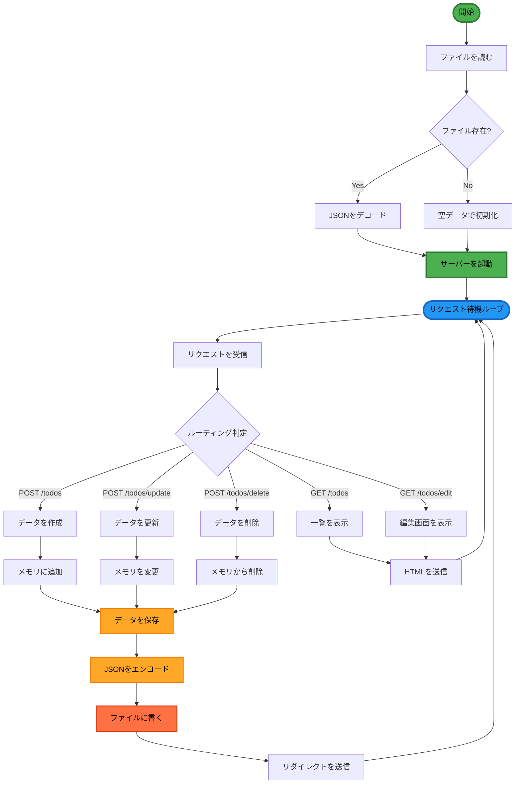

# Todo App

Go 標準ライブラリを使った学習用 Todo アプリケーション

## 📝 プロジェクト概要

このプロジェクトは、**Go 標準ライブラリ（特に `net/http`）の理解を深めること**を目的とした学習用 Web アプリケーションです。

- 外部 Web フレームワーク（Gin / Echo / Fiber 等）は使用していません
- プロダクション品質ではなく、**理解・可読性・段階的な学習**を最優先しています
- CRUD 操作の基本を Go の標準機能のみで実装しています

## 🛠️ 技術スタック

- **Go**: 標準ライブラリのみ使用
  - `net/http`: HTTP サーバー、ルーティング、ハンドラー
  - `html/template`: テンプレートエンジン
  - `strconv`: 型変換
  - `encoding/json`: JSON エンコード/デコード
  - `os`: ファイル読み書き
- **HTML**: サーバーサイドレンダリング
- **JSON**: データ永続化フォーマット
- **Air**: ホットリロード（開発用）

## 🚀 セットアップ

### 前提条件

- Go 1.21 以上がインストールされていること
- (オプション) Air がインストールされていること

### インストール

```bash
# リポジトリをクローン
git clone <repository-url>
cd 02_ToDoApp

# 依存関係の確認
go mod tidy
```

### 実行方法

#### 通常実行

```bash
go run .
```

#### ホットリロード（Air 使用）

```bash
air
```

サーバーが起動したら、ブラウザで `http://localhost:8000/todos` を開いてください。

## ✨ 機能

- ✅ **Create**: 新しい Todo を追加
- ✅ **Read**: Todo 一覧を表示
- ✅ **Update**: 既存の Todo を編集
- ✅ **Delete**: Todo を削除

## 📂 ディレクトリ構成

```
03_ToDoApp_Persistence/
├── main.go              # エントリーポイント、ルーティング設定
├── todo.go              # Todo の構造体、ハンドラー関数、永続化処理
├── templates/           # HTML テンプレート
│   ├── index.html       # 一覧・追加画面
│   └── edit.html        # 編集画面
├── todos.json           # Todo データ（JSON形式で永続化）
├── tmp/                 # Air の一時ファイル（.gitignore）
├── go.mod               # Go モジュール定義ファイル
├── go.sum               # 依存パッケージのチェックサムファイル（自動生成）
├── .air.toml            # Air 設定ファイル
├── CLAUDE.md            # プロジェクト方針・ガイドライン
└── README.md            # このファイル
```

### ファイル説明

#### go.mod
- プロジェクトのモジュール名と依存関係を定義
- `go get` や `go mod tidy` で自動更新される

#### go.sum
- 依存パッケージの整合性を保証するチェックサムファイル
- **完全に自動生成される（手動編集禁止）**
- 同じバージョンの依存パッケージを使うことを保証

## 🎯 実装の特徴

### ID 管理

- 各 Todo に一意の ID を自動採番
- 削除があっても ID が重複しないように、最大値+1 方式を採用

### HTTP メソッド

- **GET**: データ取得、画面表示
- **POST**: データ作成、更新、削除

※ HTML フォームの制約により、PUT/DELETE は使用せず POST で統一

### PRG パターン

更新・削除処理の後は、必ずリダイレクトを実行（Post-Redirect-Get パターン）：
- ブラウザのリロードによる重複送信を防止
- URL とページ内容の一致を保証

## 🧑‍💻 開発方針

詳細は [CLAUDE.md](./CLAUDE.md) を参照してください。

### 基本方針

1. **Go 標準ライブラリ限定**: フレームワーク不使用
2. **最小・明示的な実装**: 読みやすさ・理解しやすさ優先
3. **1 関数 = 1 責務**: 関数を小さく保つ
4. **段階的な学習**: 必要になったタイミングで機能追加

### コーディング規約

- インデント: タブ
- 命名規則: Go の慣習に従う（公開関数は PascalCase、非公開は camelCase）
- エラーハンドリング: `if err != nil` パターンで即座に処理

## 📖 学習ポイント

このプロジェクトを通じて学べること：

1. **HTTP の基礎**
   - リクエスト/レスポンスの仕組み
   - HTTP メソッド（GET/POST）の使い分け
   - ステータスコード

2. **Go の HTTP サーバー**
   - `http.HandleFunc` によるルーティング
   - ハンドラー関数の書き方
   - フォームデータの取得

3. **テンプレートエンジン**
   - データの埋め込み
   - ループ処理（`{{range}}`）
   - 条件分岐

4. **CRUD の実装**
   - データの追加・取得・更新・削除
   - スライス操作
   - ID による要素の特定

5. **データ永続化（JSON ファイル）**
   - JSON エンコード/デコード（`json.Marshal`, `json.Unmarshal`）
   - ファイル I/O（`os.ReadFile`, `os.WriteFile`）
   - ポインタの理解（値渡し vs ポインタ渡し）
   - 起動時のデータ読み込み
   - 変更時のデータ保存

6. **Web 開発のベストプラクティス**
   - PRG パターン
   - エラーハンドリング
   - リダイレクト

## 📊 システムフロー図

### 全体の動作フロー

以下の図は、サーバー起動からリクエスト処理、データ永続化までの全体の流れを示しています。



### 重要な概念

#### 1. **メモリとファイルの関係**

```
起動時:  todos.json → メモリ (var todos []Todo)
実行中:  すべての操作はメモリ上で実行
変更時:  メモリ → todos.json に保存
```

#### 2. **データ永続化の仕組み**

- **saveTodos()**: メモリの `todos` を JSON 形式でファイルに保存
  - ステップ1: Go のスライス → JSON エンコード
  - ステップ2: JSON → ファイル書き込み

- **loadTodos()**: ファイルから JSON を読み込んでメモリに展開（※実装予定）
  - ステップ1: ファイル読み込み → JSON データ取得
  - ステップ2: JSON → Go のスライスにデコード

#### 3. **PRGパターン（Post-Redirect-Get）**

データ変更（POST）の後は必ずリダイレクト：
- ブラウザのリロード時に再送信されるのを防ぐ
- URL とページ内容を一致させる

## 🔄 今後の拡張案

- [x] データの永続化（JSON ファイル）← 完了
- [ ] データベース化（SQLite）
- [ ] Todo の完了/未完了ステータス
- [ ] Todo の並び替え
- [ ] 削除時の確認ダイアログ（JavaScript）
- [ ] CSS によるスタイリング

## 📄 ライセンス

学習用プロジェクトのため、ライセンスは特に設定していません。
